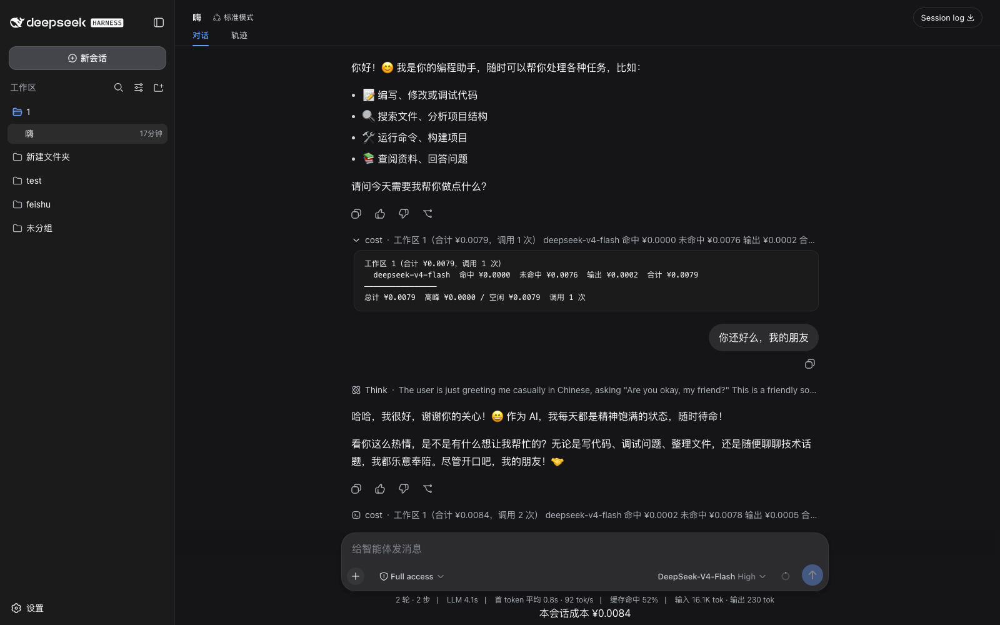

# dsh-cost-tracker

> 🇨🇳 [中文说明](README.zh.md)

[](https://awesome-dsh-plugin.com)

Token cost tracking for DeepSeek Harness, with per-model configurable pricing and
peak/off-peak rates.



## What it does

- Prices every finalized LLM call (`assistant/message` usage) against a
  per-model pricing table you configure — cache-hit / cache-miss input, output,
  and optional peak-window rates.
- Publishes a per-session `cost` projection (total / peak / off-peak / per-model),
  consumed by the Web UI to show a live session cost readout.
- Flags calls that land in a configured peak window.
- Models without a pricing entry are surfaced as "unconfigured" with a
  placeholder, so you know to add them.

## Installation

Install into a dsh profile straight from GitHub — the plugin ships a
`dsh.bundle` layer, so `dsh plugin add` enables it automatically:

```sh
dsh plugin --profile web add github:yflmq001/dsh-cost-tracker
```

Pricing starts empty (`models: {}`); fill in your models under the plugin's
`config` (see below). To override defaults, add a `cost-tracker` row to the
profile's own `cordis.patch.yml` — later layers win by row id.

> ⚠️ When overriding, address the row by its **`id`** (`cost-tracker`), **not** by
> `name`. Cordis non-insert patches locate the target line by `id`; a `name`-keyed
> override row is silently dropped, leaving prices at `models: {}`.

The cross-session bill persists through dsh's storage domain; a profile
without a storage backend keeps the bill in memory only.

## Configuration

Pricing lives under the plugin's config (Schemastery-validated). All prices are
currency units per **million tokens**; you fill them in manually (no scraping).

```yaml
- id: cost-tracker
  config:
    models:
      deepseek-v4-flash:
        inputMiss: 1.0        # cache-miss input
        inputHit: 0.02        # cache-hit input (omit if no cache tier)
        output: 2.0
        peak:                 # peak tier: hours + toggle + prices
          hours: ["09:00-12:00", "14:00-18:00"]   # Beijing time
          enabled: true       # false = peak off (base rates always); omit = on
          inputMiss: 3.0
          inputHit: 0.10
          output: 9.0
      gpt-4o:                 # any model the harness can reach
        inputMiss: 2.5
        output: 10.0
```

## Session projection

The plugin registers the `cost` projection:

```ts
{
  totalCost, peakCost, offpeakCost,
  callCount, unconfiguredCalls, unconfiguredModels,
  byModel: { [model]: { inputHit, inputMiss, output, total } },
}
```

Cache writes are priced at the miss rate (providers bill the write at the miss
tier; the written tokens become cache hits on a later call).

## Billing correctness

Two choices keep the numbers honest:

- **Cache writes are billed at the miss rate, not the hit rate.** Providers
  charge cache writes at the cache-miss input tier (e.g. DeepSeek $0.14/M vs
  $0.0028/M hit) — pricing a write as a hit undercounts by ~50x whenever a
  session writes fresh context. Some cost plugins fold cache writes into the
  hit bucket; this plugin does not.
- **Unknown models are never silently priced.** A model with no pricing entry
  is surfaced as "unconfigured" with a placeholder in the projection and UI,
  so a guessed default can't hide in your bill. You add the price, or you see
  the gap.

## Known Limitations and Deferred Work

- Per-session cost is a projection over the durable log (replayed); the
  cross-session global bill and `/cost` command are available.
- Non-DeepSeek models need their pricing filled in manually; there is no
  automatic price lookup.
- Developer preview: `assistant/message.usage` is absent when the adapter
  reports no accounting, and the session format has no compatibility promise.
