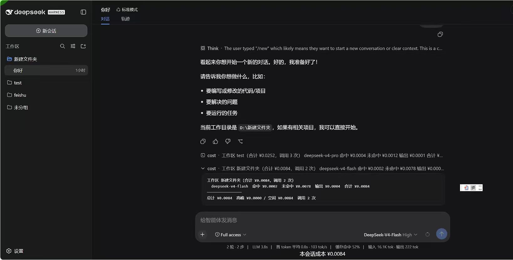

# dsh-cost-tracker

> 🇬🇧 [English](README.md)

DeepSeek Harness 的 Token 成本追踪插件：按模型配置价格，支持缓存命中/未命中分桶计费，以及高峰/低谷时段价格。



## 功能

- 对每一次 LLM 调用（`assistant/message` usage）按你配置的模型价格表计费 —— 区分缓存命中/未命中输入、输出，以及可选的高峰时段价格。
- 发布 per-session 的 `cost` 投影（总额 / 高峰 / 低谷 / 按模型），Web UI 据此显示实时会话成本条。
- 标记落在高峰时段的调用。
- 未配置价格的模型会显示「未配置」占位提示，提醒你补价。

## 安装

从 GitHub 直接安装到 dsh profile —— 插件自带 `dsh.bundle` 层，`dsh plugin add` 装完即自动启用：

```sh
dsh plugin --profile web add github:yflmq001/dsh-cost-tracker
```

价格初始为空（`models: {}`），在插件的 `config` 里填模型价格（见下文）。要覆盖默认值，在 profile 自己的 `cordis.patch.yml` 里加一行 `cost-tracker`——后应用的层按行 id 胜出。

跨会话账单通过 dsh 的 storage domain 持久化；没有配置 storage 后端的 profile 只会在内存中记账。

## 配置

价格在插件的 `config` 里配置（Schemastery 校验）。所有价格单位是**元 / 百万 token**，手动填写（不自动抓取）。

```yaml
- name: 'dsh-cost-tracker'
  config:
    models:
      deepseek-v4-flash:
        inputMiss: 1.0        # 输入·未命中缓存
        inputHit: 0.02        # 输入·命中缓存（无缓存档可省略）
        output: 2.0           # 输出
        peak:                 # 高峰档：时段 + 开关 + 价格
          hours: ["09:00-12:00", "14:00-18:00"]   # 北京时间
          enabled: true       # false = 关闭高峰价（一直按基础价）；省略 = 开启
          inputMiss: 3.0
          inputHit: 0.10
          output: 9.0
      gpt-4o:                 # 任何 harness 能访问的模型
        inputMiss: 2.5
        output: 10.0
```

字段说明：

- `inputMiss` 输入未命中缓存价、`inputHit` 输入命中缓存价、`output` 输出价，单位「元 / 每百万 token」
- `peak` 块可整块删掉（不配高峰价就一直按基础价）
- `peak.hours` 高峰时段（北京时间 `HH:MM-HH:MM`）
- `peak.enabled` 开关：`false` 关闭高峰价，`true` 或省略则开启
- 要加新模型，直接在 `models:` 下加一个 key，key 必须和实际调用的模型名完全一致

## 会话投影

插件注册 `cost` 投影：

```ts
{
  totalCost, peakCost, offpeakCost,
  callCount, unconfiguredCalls, unconfiguredModels,
  byModel: { [model]: { inputHit, inputMiss, output, total } },
}
```

缓存写入按未命中价计费（提供方按未命中档计写入；写入的 token 在后续调用中变成缓存命中）。

## 已知限制与待办

- 每会话成本是对持久化日志（重放）的投影；跨会话全局账单和 `/cost` 命令已可用。
- 非 DeepSeek 模型需要手动填价，没有自动价格查询。
- 开发预览：当 adapter 不报账时 `assistant/message.usage` 缺失，且会话格式不保证兼容。
